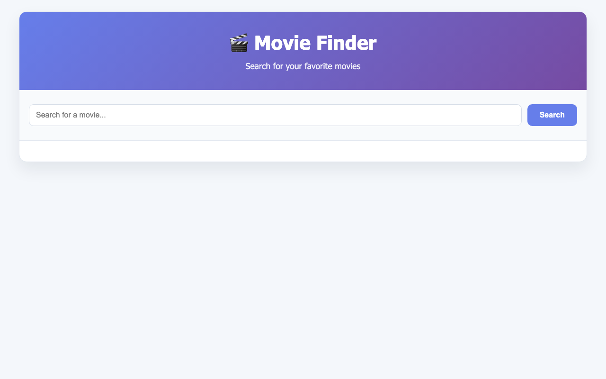

# Movie Finder App

Movie Finder App is a JavaScript web app that searches real movie data from the OMDb API and shows useful results in a modern card layout.

**Live demo:** https://noamios.github.io/portfolio/movie-finder-app/

## Preview



## What This App Does

- Search by movie title
- Fetch live data from OMDb API
- Show movie posters and key details
- Display loading state while fetching results
- Handle no-results and network errors gracefully
- Open extra movie information on item selection

## User Flow

1. Enter a movie name in the search input
2. Submit search and wait for live results
3. Browse matching movie cards
4. Select a movie to view more details

## Run Locally

```bash
git clone https://github.com/Noamios/portfolio.git
cd portfolio/movie-finder-app
open index.html
```

On first search you'll be prompted for an OMDb API key. Get a free key at https://www.omdbapi.com/apikey.aspx — it's stored in your browser's `localStorage` and never sent anywhere else.

## Tech Stack

- HTML
- CSS
- JavaScript
- OMDb API
