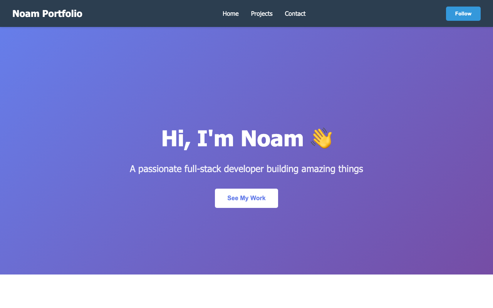

# Personal Portfolio Site

Personal Portfolio Site is a single-page website that introduces Noam, highlights featured projects, and provides a contact section.

**Live demo:** https://noamios.github.io/portfolio/personal-portfolio-site/

## Preview



## What This App Does

- Presents a hero section with personal introduction
- Includes navigation to home, projects, and contact sections
- Displays project cards with short descriptions
- Uses a clean, responsive layout for desktop and mobile
- Provides a contact form UI for user inquiries

## Main Sections

- Home: intro and call to action
- Projects: portfolio cards for selected work
- Contact: name, email, and message fields
- Footer: site ownership details

## Run Locally

```bash
git clone https://github.com/Noamios/portfolio.git
cd portfolio/personal-portfolio-site
open index.html
```

## Tech Stack

- HTML
- CSS
