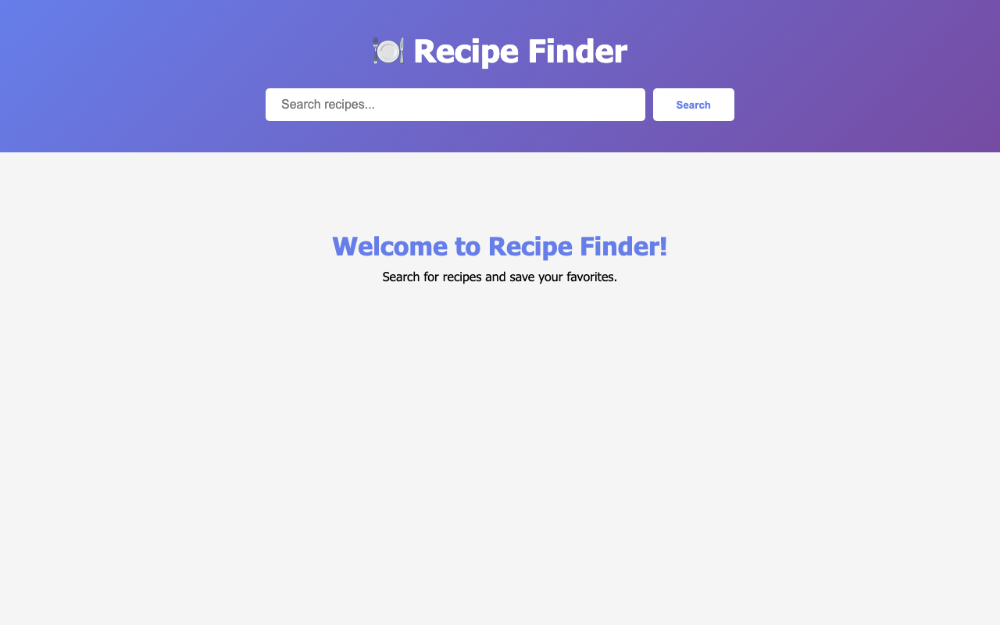

# Recipe Finder App

Recipe Finder is a React web app for discovering recipes by keyword and saving favorites for quick access.

**Live demo:** https://noamios.github.io/portfolio/recipe-finder-app/

## Preview



## What This App Does

- Search meals using TheMealDB API
- Show recipe cards with image, name, and category
- Open a full recipe details modal
- Display ingredient and measurement lists automatically
- Save favorite recipes in browser local storage
- Keep favorites available between sessions

## User Flow

1. Enter a recipe name in the search bar
2. Browse matching recipes
3. Open a recipe to view ingredients and instructions
4. Mark recipes as favorites and manage your personal list

## Run Locally

```bash
git clone https://github.com/Noamios/portfolio.git
cd portfolio/recipe-finder-app
npm install
npm start
```

The dev server runs at http://localhost:3000.

## Folder Structure

```
recipe-finder-app/
├── public/              # static assets served as-is
│   ├── index.html
│   ├── favicon.ico
│   └── manifest.json
├── src/                 # React source
│   ├── index.js         # app entry point
│   ├── index.css
│   ├── App.js           # root component (search, results, favorites)
│   ├── App.css
│   ├── App.test.js
│   ├── reportWebVitals.js
│   └── setupTests.js
├── package.json
└── package-lock.json
```

## Tech Stack

- React
- JavaScript
- CSS
- TheMealDB API
