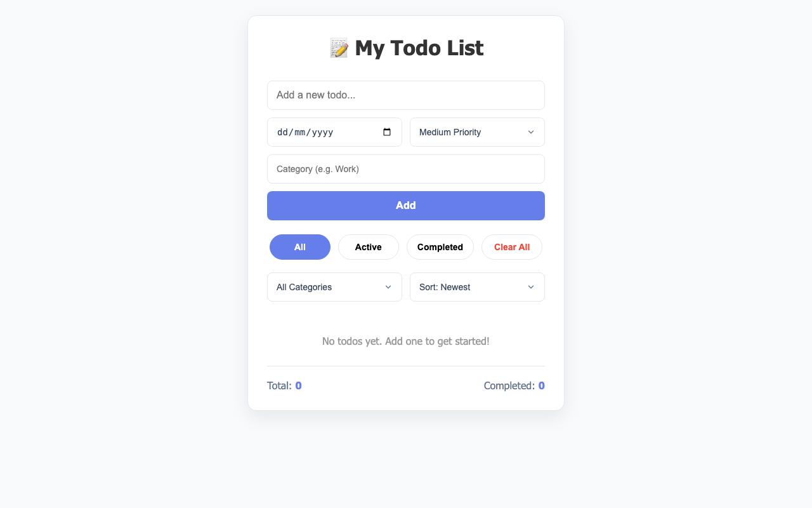

# Todo List App

Todo List App is a clean task manager built with vanilla JavaScript. It helps users capture daily tasks, track progress, and stay organized.

**Live demo:** https://noamios.github.io/portfolio/todo-list-app/

## Preview



## What This App Does

- Add new tasks quickly from one input
- Mark tasks as completed or active
- Delete tasks from the list
- Filter by all, active, or completed tasks
- Show task statistics for better progress tracking
- Save task data in local storage

## User Flow

1. Add a task from the input area
2. Use checkbox actions to complete tasks
3. Filter views to focus on active or completed items
4. Return later with data still saved in the browser

## Run Locally

```bash
git clone https://github.com/Noamios/portfolio.git
cd portfolio/todo-list-app
open index.html
```

## Tech Stack

- HTML
- CSS
- JavaScript
- Browser localStorage
